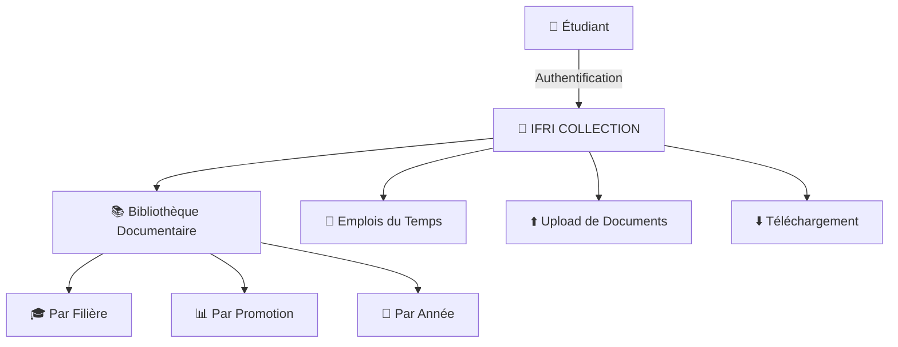

<div align="center">

# 📚 IFRI COLLECTION

### *Bibliothèque Numérique de l'IFRI*


---

**Une plateforme moderne et sécurisée pour centraliser les ressources académiques**  
*Fait avec ❤️ pour les étudiants de l'IFRI*

[🚀 Démo](#) • [📖 Documentation](#) • [🐛 Signaler un Bug](#) • [✨ Demander une Fonctionnalité](#)

</div>

---

## 🎯 Vision du Projet

> *"Transformer l'accès au savoir par la technologie"*

**IFRI COLLECTION** est bien plus qu'une simple plateforme de partage de documents. C'est une **infrastructure numérique stratégique** conçue pour moderniser l'expérience académique à l'Institut de Formation et de Recherche en Informatique (IFRI).

Dans un monde où la transformation digitale n'est plus une option mais une nécessité, IFRI COLLECTION pose les **fondations d'un écosystème numérique** capable d'accompagner la croissance et les ambitions de l'institut au niveau national et sous-régional.

---

## 🔥 Problématique

L'IFRI fait face à plusieurs défis majeurs :

- 📄 **Dispersion des ressources** : Documents académiques éparpillés entre supports physiques et partages informels
- 🔍 **Accès difficile** : Absence d'un système centralisé pour retrouver les anciennes épreuves et cours
- ⏰ **Gestion des emplois du temps** : Diffusion non structurée et parfois tardive
- 🔒 **Manque de traçabilité** : Perte potentielle d'informations académiques précieuses
- 💡 **Décalage technologique** : Un institut d'informatique sans infrastructure numérique dédiée

---

## ✨ La Solution

### 🎨 Une Plateforme Complète et Moderne

IFRI COLLECTION centralise l'ensemble de l'écosystème académique dans un espace unique, sécurisé et accessible 24/7.



---

## 🚀 Fonctionnalités Principales

### 🔐 **Authentification Sécurisée**
- Système de connexion robuste avec gestion des sessions
- Protection des données conformément aux meilleures pratiques
- Accès contrôlé et réservé aux étudiants autorisés

### 📤 **Upload de Documents**
Les étudiants peuvent contribuer activement en publiant :
- ✅ Anciennes épreuves
- ✅ Modules de cours
- ✅ Supports pédagogiques
- ✅ Travaux dirigés

### 📥 **Téléchargement des Ressources**
- Accès instantané aux documents par filière et promotion
- Organisation hiérarchique intuitive
- Recherche rapide et efficace

### 📅 **Gestion des Emplois du Temps**
- Publication centralisée par promotion
- Mise à jour en temps réel
- Accessible à tout moment depuis n'importe quel appareil

### 🛡️ **Administration & Modération**
- Supervision des contenus publiés
- Validation et organisation de la base documentaire
- Maintenance de l'intégrité de la plateforme

---

## 🏗️ Architecture Technique

### 📋 Stack Technologique

<div align="center">

| Frontend | Backend | Base de Données | Outils |
|----------|---------|----------------|--------|
|  |  |  |  |
|  |  |  |  |
|  |  |  |  |
|  |  | |  |

</div>

### 🎯 Choix Techniques

#### **Frontend**
- **React** + **TypeScript** : Développement type-safe et maintenable
- **Vite** : Temps de build ultra-rapides et HMR performant
- **Tailwind CSS** : Styling rapide et cohérent
- **shadcn/ui** : Composants UI modernes et accessibles

#### **Backend**
- **Node.js** + **Express** : Architecture serveur robuste et scalable
- **JWT** : Authentification sécurisée par tokens
- **API RESTful** : Communication standardisée et documentée

#### **Base de Données**
- **PostgreSQL** : Gestion relationnelle fiable et performante
- **Supabase** : Backend-as-a-Service avec authentification intégrée
- **Cloud Storage** : Stockage sécurisé et distribué des fichiers

---

## 📊 Organisation des Données

```
📁 IFRI COLLECTION
├── 🎓 Licence 1
│   ├── 📚 Informatique Générale
│   │   ├── 📄 Anciennes Épreuves
│   │   ├── 📖 Modules de Cours
│   │   └── 📅 Emploi du Temps
│   └── 💼 Génie Logiciel
│       └── ...
├── 🎓 Licence 2
│   └── ...
├── 🎓 Licence 3
│   └── ...
└── 🎓 Master
    └── ...
```

---

## 🎯 Objectifs du Projet

### 🌟 Objectif Général

> Mettre en place une plateforme numérique centralisée permettant la gestion, la consultation et le partage sécurisé des ressources académiques, dans une perspective de modernisation et de transformation digitale de l'IFRI.

### 🎪 Objectifs Spécifiques

- ✅ Centraliser les anciennes épreuves, modules et documents dans une base unique
- ✅ Permettre l'upload et le téléchargement encadré de fichiers académiques
- ✅ Publier les emplois du temps de manière organisée par promotion
- ✅ Garantir un accès sécurisé via authentification
- ✅ Créer une infrastructure évolutive pour de futures fonctionnalités
- ✅ Contribuer à la digitalisation des services internes de l'IFRI

---

## 💡 Impact du Projet

### 📚 Impact Académique
- Accès facilité aux ressources pour tous les étudiants
- Meilleure préparation aux examens grâce aux anciennes épreuves
- Réduction de la perte et dispersion des documents

### 🏛️ Impact Institutionnel
- Valorisation de l'image d'IFRI comme institut innovant
- Renforcement de l'autonomie numérique
- Première étape vers une digitalisation complète

### 🚀 Impact Stratégique
- Positionnement comme acteur innovant au niveau national et sous-régional
- Infrastructure évolutive pour futurs projets
- Encouragement de la participation collaborative

---

## 🛠️ Installation

### Prérequis

- Node.js (v18 ou supérieur)
- npm ou yarn
- Git

### Installation Locale

```bash
# Cloner le repository
git clone https://github.com/votre-username/ifri-collection.git

# Accéder au dossier
cd ifri-collection

# Installer les dépendances
npm install

# Configurer les variables d'environnement
cp .env.example .env

# Lancer le serveur de développement
npm run dev
```

L'application sera accessible sur `http://localhost:5173`

---

## 📜 Scripts Disponibles

| Commande | Description |
|----------|-------------|
| `npm run dev` | Démarre le serveur de développement avec hot-reload |
| `npm run build` | Compile l'application pour la production |
| `npm run preview` | Prévisualise le build de production |
| `npm run lint` | Vérifie la qualité du code avec ESLint |
| `npm run format` | Formate le code avec Prettier |
| `npm run type-check` | Vérifie les types TypeScript |

---

## 🗂️ Structure du Projet

```
ifri-collection/
├── 📁 src/
│   ├── 📁 components/      # Composants React réutilisables
│   ├── 📁 pages/          # Pages de l'application
│   ├── 📁 lib/            # Utilitaires et helpers
│   ├── 📁 hooks/          # Custom React hooks
│   ├── 📁 services/       # Services API
│   ├── 📁 types/          # Types TypeScript
│   ├── 📁 assets/         # Images, fonts, etc.
│   └── App.tsx            # Composant principal
├── 📁 public/             # Fichiers statiques
├── 📄 package.json        # Dépendances du projet
├── 📄 tsconfig.json       # Configuration TypeScript
├── 📄 vite.config.ts      # Configuration Vite
└── 📄 tailwind.config.js  # Configuration Tailwind
```

---

## 🤝 Contribution

Les contributions sont les bienvenues ! Pour contribuer :

1. 🍴 Fork le projet
2. 🌿 Créez votre branche (`git checkout -b feature/AmazingFeature`)
3. 💾 Committez vos changements (`git commit -m 'Add: Amazing Feature'`)
4. 📤 Pushez vers la branche (`git push origin feature/AmazingFeature`)
5. 🔀 Ouvrez une Pull Request

### 📋 Conventions de Commit

Nous utilisons les [Conventional Commits](https://www.conventionalcommits.org/) :

- `feat:` Nouvelle fonctionnalité
- `fix:` Correction de bug
- `docs:` Documentation
- `style:` Formatage du code
- `refactor:` Refactorisation
- `test:` Ajout de tests
- `chore:` Tâches de maintenance

---

## 🔒 Sécurité

- 🔐 Authentification JWT sécurisée
- 🛡️ Protection contre les injections SQL
- 🚫 Validation des entrées utilisateur
- 🔒 Chiffrement des données sensibles
- ✅ Modération des contenus uploadés

---

## 📱 Roadmap

- [x] Phase 1 : Authentification et gestion utilisateurs
- [x] Phase 2 : Upload et téléchargement de documents
- [ ] Phase 3 : Système de recherche avancée
- [ ] Phase 4 : Application mobile (Android/iOS)
- [ ] Phase 5 : Système de notifications
- [ ] Phase 6 : Analytics et statistiques
- [ ] Phase 7 : API publique pour intégrations

---

## 👨‍💻 Auteur

**AMOUSSOU Siméon Céphas**  
Étudiant à l'IFRI - Université d'Abomey-Calavi

📧 Email : [simeoncephasamoussou@gmail.com](mailto:simeoncephasamoussou@gmail.com)  
🐙 GitHub : [https://github.com/Cephas-67](https://github.com/Cephas-67)  
💼 LinkedIn : [https://www.linkedin.com/in/sim%C3%A9on-c%C3%A9phas-amoussou-0ba010368?utm_source=share&utm_campaign=share_via&utm_content=profile&utm_medium=android_app](https://www.linkedin.com/in/sim%C3%A9on-c%C3%A9phas-amoussou-0ba010368?utm_source=share&utm_campaign=share_via&utm_content=profile&utm_medium=android_app)

---

## 📄 Licence

Ce projet est sous licence MIT. Voir le fichier [LICENSE](LICENSE) pour plus de détails.

---

## 🙏 Remerciements

- L'administration de l'IFRI pour son soutien
- Les étudiants de l'IFRI pour leurs retours constructifs
- La communauté open-source pour les outils extraordinaires

---

<div align="center">

### ⭐ Si ce projet vous plaît, n'hésitez pas à lui donner une étoile !

**Fait avec ❤️ à Cotonou, Bénin 🇧🇯**

---

*IFRI COLLECTION - Vers une excellence académique digitale*

</div>
